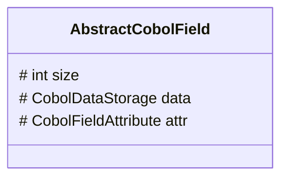
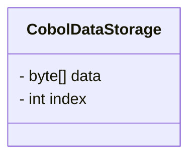

# opensource COBOL 4J: Java変換解説

## はじめに

opensource COBOL 4Jは、COBOLプログラムをJavaプログラムに変換して実行するコンパイラである。
本文書ではopensource COBOL 4JのCOBOLからJavaへの変換方法について、重要な箇所を解説する。

## 変数・集団項目

COBOLで定義された変数は、AbstractCobolFieldクラスのインスタンスへ変換される。
**PICTURE句に応じて、各変数はAbstractCobolFieldクラスの派生クラスへと変換される。**
例えば、`PIC 9(5)`の変数はCobolNumericFieldクラスのインスタンスへ変換され、`PIC X(3)`の変数はCobolAlphanumericFieldに変換される。

また、AbstractCobolFieldはメモリ上のデータサイズを示すint型の変数、実際のデータをバイト配列として保持するCobolDataStorageクラス、その他の情報を格納するCobolFieldAttributeクラスを持つ。



### CobolDataStorageクラス



CobolDataStorageクラスはバイト配列dataと、そのバイト配列内でのデータの格納されている先頭位置を保持するindexを持つ。

```cobol
       WORKING-STORAGE  SECTION.
       01 REC.
         05 FIELD-A PIC X(10).
         05 FIELD-B PIC (5).
         05 FIELD-B PIC X(10).
```

上記の変数定義に対して、概ね下記のようなコードを生成することで、集団項目の機能を実現している。
ただし、下記は説明のためのコードであり、実際に生成されるコードとは異なることに注意すること。

```java
byte[] bytes = new byte[25];
// 集団項目RECに対応するCobolDataStorageクラスのインスタンス。
// バイト配列dataを保持し、データの開始位置は0
CobolDataStorage rec_storage = new CobolDataStorage(/* data= */ bytes, /* index= */ 0);
// 集団項目FIELD_Aに対応するCobolDataStorageクラスのインスタンス。
// バイト配列dataを保持し、データの開始位置は0
CobolDataStorage field_a_storage = rec_storage.getSubDataStorage(/* data= */ bytes, /* index= */ 0);
// 集団項目FIELD_Bに対応するCobolDataStorageクラスのインスタンス。
// バイト配列dataを保持し、データの開始位置は10
CobolDataStorage field_b_storage = rec_storage.getSubDataStorage(/* data= */ bytes, /* index= */ 10);
// 集団項目FIELD_Cに対応するCobolDataStorageクラスのインスタンス。
// バイト配列dataを保持し、データの開始位置は15
CobolDataStorage field_b_storage = rec_storage.getSubDataStorage(/* data= */ bytes, /* index= */ 15);
```

### CobolFieldAttributeクラス

CobolFieldAttributeクラスは変数に関する様々な情報を保持するクラスである。
CobolFieldAttributeクラスのメンバ変数に格納される情報は以下の通りである。
#### type
typeは文字列型、数値型、集団項目等の情報を表すメンバ変数である。
typeの保持する値に応じて、決まったAbstractCobolFieldクラスの派生クラスが使用される。

| 定数名 | 値 | AbstractCobolFieldの派生クラス | 説明 |
| --- | --- | --- | --- |
| COB_TYPE_UNKNOWN | 0x00 | なし | 未使用 |
| COB_TYPE_GROUP |  0x01 | CobolGroupField | 集団項目 |
| COB_TYPE_BOOLEAN | 0x02 | なし | 未使用 |
| COB_TYPE_NUMERIC_DISPLAY | 0x10 | CobolNumericField | 数値型(`PIC 9`, `PIC 99V9`等) |
| COB_TYPE_NUMERIC_BINARY | 0x11 | CobolNumericBinaryField | バイナリの数値型(`PIC 9 COMP`, `PIC 9 COMP-5`等) |
| COB_TYPE_NUMERIC_PACKED | 0x12 | CobolNumericPackedField | パック10進数(`PIC 9 COMP-3`)|
| COB_TYPE_NUMERIC_FLOAT | 0x13 | なし | COMP-1が指定されていることを示す。COMP-1は未実装。 |
| COB_TYPE_NUMERIC_DOUBLE | 0x14 | なし | COMP-2が指定されていることを示す。COMP-2は未実装。 |
| COB_TYPE_ALPHANUMERIC | 0x21 | CobolAlphanumericField |文字列型(`PIC X`, `PIC X(10)`等) |
| COB_TYPE_ALPHANUMERIC_ALL | 0x22 | CobolAlphanumericAllField | 文字列定数(SPACE等)に割り当てられる。 |
| COB_TYPE_ALPHANUMERIC_EDITED | 0x23 | CobolAlphanumericEditedField | 文字列編集項目 |
| COB_TYPE_NUMERIC_EDITED | 0x24 | CobolNumericEditedField | 数値編集項目 |
| COB_TYPE_NATIONAL | 0x40 | CobolNationalField |日本語型(`PIC N`, `PIC N(10)`等) |
| COB_TYPE_NATIONAL_EDITED | 0x41 | CobolNationalEditedField | 日本語編集項目 |
| COB_TYPE_NATIONAL_ALL | 0x42 | CobolNationalAllField | 日本語項目に代入する文字列定数(SPACE等)に割り当てられる。 |

#### digits
digitsは`PIC 9(5)`等の数値型の変数のときに使われる、変数の桁数を表すメンバ変数である。
例えば、`PIC 9(5)`の場合digitsには5が格納され、`PIC 9(3)V9(4)`の場合は7が格納される。

#### scale
scaleは小数点の位置を表すためのメンバ変数である。
例えば`PIC 9(5)`の場合は`0`が格納され、`PIC 9(3)V9(4)`の場合は`4`が格納され、`PIC 9(3)PP`の場合は`-2`が格納される。

#### flag
flagはその他の情報を格納するためのメンバ変数である。
下記の表に示す値をもとに、ビットごとの論理和を計算してflagに値を格納する。

例えば、`PIC S9(5) SIGN LEADING SEPARATE`の場合を考える。
この場合は、下記の表のCOB_FLAG_SIGN, COB_FLAG_SIGN_SEPARATE, COB_FLAG_SIGN_LEADINGの3つの条件に合致するため、flagには0x01 | 0x02 | 0x04 (=0x07)が格納される。

| 定数名 | 値 | 説明 |
| --- | --- | --- |
| COB_FLAG_HAVE_SIGN | 0x01 | `PIC S9`等の符号付きの数値型であることを示す。 |
| COB_FLAG_SIGN_SEPARATE | 0x02 | `PIC S9 SIGN TRAILING SEPARATE`または`PIC S9 SIGN LEADING SEPARATE`のように符号の分離が指定されていることを示す。 |
| COB_FLAG_SIGN_LEADING | 0x04 | `PIC S9(2) SIGN LEADING`のように符号が先頭側に格納されることを示す。 |
| COB_FLAG_BLANK_ZERO | 0x08 | `PIC 9 BLANK WHEN ZERO`のようにBLANK WHEN ZERO指定されたことを示す。 |
| COB_FLAG_JUSTIFIED | 0x10 | `PIC X(3) JUSTIFIED RIGHT`のようにJUSTIFIED RIGHTが指定されたことを示す。 |
| COB_FLAG_BINARY_SWAP | 0x20 | COMP,COMP-4,BINARYのいずれかが指定されていることを示す。 |
| COB_FLAG_REAL_BINARY | 0x40 | SIGNED-SHORT,SIGNED-INT,SIGNED-LONG,UNSIGNED-SHORT,UNSIGNED-INT,UNSIGNED-LONGのいずれかが指定されていることを示す。 |
| COB_FLAG_IS_POINTER | 0x80 | POINTERが指定されていることを示す。POINTERは未実装。 |

#### pic

picはPICTURE句に書かれた文字列を保持するメンバ変数であるが、コンパイラが実行時に不要と判定した場合はnullが格納される。

編集項目の場合は特別なフォーマットのデータが格納される。
例えば、PICTURE句が`PIC ++9(3),9(2)`の数値編集項目を考える。
このPICTURE句は+が2文字、9が3文字、,が1文字、9が2文字の合計8文字の文字列であるため、picには
"+<<<2を示す4バイト整数>>>9<<<3を示す4バイト整数>>>,<<<1を示す4バイト整数>>>9<<<2を示す4バイト整数>>>"
が格納される。

## PROCEDURE DIVISION

PROCEDURE DIVISIONの各命令は、その命令に対応するlibcobj.jarに定義されたメソッドの呼び出しに変換される。
以下に代表的な命令の変換例を示す。

### DISPLAY文

COBOLのDISPLAY文は、CobolTerminalクラスのdisplayメソッドの呼び出すコードに変換される。

```cobol
DISPLAY "HELLO".
```

```java
/* a.cbl:6: DISPLAY */
{
  CobolTerminal.display (0, 1, 1, c_1);
}
```

このように各文はブロック`{}`で囲まれ、その上にコメントで元のCOBOLソースコードのファイル名・行番号と、変換されたメソッドの呼び出しを示すコメントが付けられる。

### 制御文
IF文やPERFORM VARYING文は、それぞれJavaのif文やfor文に変換される。

以下はIF文の変換例。
```cobol
         IF 1 = 1 THEN
                DISPLAY "HELLO"
         ELSE
                DISPLAY "WORLD"
         END-IF.
```

```java
        /* a.cbl:6: IF */
        {
          if (((long)c_1.cmpInt (1) == 0L))
            {
              /* a.cbl:7: DISPLAY */
              {
                CobolTerminal.display (0, 1, 1, c_2);
              }
            }
          else
            {
              /* a.cbl:9: DISPLAY */
              {
                CobolTerminal.display (0, 1, 1, c_3);
              }
            }
        }
```

以下はPERFORM VARYING文の変換例。

```cobol
       PERFORM VARYING C FROM 1 BY 1 UNTIL C > 5
           DISPLAY C
       END-PERFORM.
```

```java
for (;;)
  {
    if (((long)b_C.cmpNumdisp (1, 5) >  0L))
      break;
    {
      /* a.cbl:8: DISPLAY */
      {
        CobolTerminal.display (0, 1, 1, f_C);
      }
    }
    f_C.addInt (1);
  }
```

### CALL文

CALL文も、libcobj.jarに定義されたメソッドの呼び出しに変換される。

```cobol
       CALL "sub".
```

```java
/* a.cbl:6: CALL */
{
  CobolModule.getCurrentModule ().setParameters ();
  call_sub = CobolResolve.resolve("sub", call_sub);
  b_RETURN_CODE.set (call_sub.run ());
}
```

opensource COBOL 4Jにおいて、CALL文で指定されたモジュール名は原則として実行時に解決される。

## プログラム全体の制御構造

COBOLでは、PROCEDURE DIVISION内はSECTIONやPARAGRAPHによって、分割される。
分割された部分を指定して、PERFORM文で処理を呼び出したり、GO TO文で特定の箇所へジャンプしたりできる。
これらの機能をJavaへ変換した際に、どのように実現されるかを解説する。
以下のプログラムを例に、詳細を説明する。

```cobol
       IDENTIFICATION   DIVISION.
       PROGRAM-ID.      prog.
       DATA             DIVISION.
       WORKING-STORAGE  SECTION.
       PROCEDURE        DIVISION.
       MAIN SECTION.
           PERFORM A-01.
           PERFORM A-02.
           PERFORM SUB.
           GO TO LAST-PROC.
       SUB SECTION.
       A-01.
           DISPLAY "A-01 START".
           DISPLAY "A-01 END".
       A-02.
           DISPLAY "SECT-02".
       LAST-PROC SECTION.
       LAST-MESSAGE.
           DISPLAY "END".
```

opensource COBOL 4Jでは、PROCEDURE DIVISION内のSECTIONやPARAGRAPHは、switch文を使った制御構造に変換される。
各ラベル（SECTION、PARAGRAPH）には一意の整数IDが割り当てられ、switch文のcaseとして使用される。

### ラベルIDの定義

各SECTIONとPARAGRAPHには、整数定数としてラベルIDが割り当てられる。

```java
/* Label IDs */
private static final int l_MAIN = 1;
private static final int l_MAIN__DEFAULT_PARAGRAPH = 2;
private static final int l_SUB = 3;
private static final int l_SUB__A_01 = 4;
private static final int l_SUB__A_02 = 5;
private static final int l_LAST_PROC = 6;
private static final int l_LAST_PROC__LAST_MESSAGE = 7;
/* Section end markers */
private static final int l_END_MAIN = 2;
private static final int l_END_SUB = 5;
private static final int l_END_LAST_PROC = 7;
```

### 実行制御の仕組み

生成されるJavaコードには、以下の状態変数とメソッドが含まれる。

```java
/* Switch-based execution state */
private int currentLabel = 0;
private java.util.ArrayDeque<int[]> performStack = new java.util.ArrayDeque<>();
```

- `currentLabel`: 現在実行中のラベルを示す整数値
- `performStack`: PERFORM文の実行範囲を管理するスタック

### メインループ構造

PROCEDURE DIVISION内の処理は、`mainLoop`というラベル付きwhileループとswitch文で制御される。

```java
private void execProcedureDivisionRange(int startLabel, int endLabel)
    throws CobolRuntimeException, CobolStopRunException {
  currentLabel = startLabel;

  mainLoop: while (currentLabel > 0 && currentLabel <= endLabel) {
    switch (currentLabel) {
    case 0:
      /* ... */

    case 2: /* l_MAIN__DEFAULT_PARAGRAPH */
      /* prog.cbl:6: PERFORM */
      performRange(l_SUB__A_01, l_SUB__A_01);
      /* prog.cbl:7: PERFORM */
      performRange(l_SUB__A_02, l_SUB__A_02);
      /* prog.cbl:8: PERFORM */
      performRange(l_SUB, l_END_SUB);
      /* prog.cbl:9: GO TO */
      if (true) { currentLabel = l_LAST_PROC; continue mainLoop; }

    case 4: /* l_SUB__A_01 */
      /* prog.cbl:12: DISPLAY */
      {
        CobolTerminal.display (0, 1, 1, c_1);
      }
      /* prog.cbl:13: DISPLAY */
      {
        CobolTerminal.display (0, 1, 1, c_2);
      }
      currentLabel = 5;
      break;

    case 5: /* l_SUB__A_02 */
      /* prog.cbl:15: DISPLAY */
      {
        CobolTerminal.display (0, 1, 1, c_3);
      }
      currentLabel = 6;
      break;

    case 7: /* l_LAST_PROC__LAST_MESSAGE */
      /* prog.cbl:18: DISPLAY */
      {
        CobolTerminal.display (0, 1, 1, c_4);
      }
      currentLabel = 0;
      break;

    default:
      currentLabel = 0;
      break;
    } /* end switch */

    /* PERFORM end check */
    while (!performStack.isEmpty()) {
      int[] top = performStack.peek();
      if (currentLabel < top[0] || currentLabel > top[1]) {
        int[] popped = performStack.pop();
        currentLabel = popped[2];
      } else {
        break;
      }
    }
  } /* end mainLoop */
}
```

### GO TO文の変換

GO TO文は、`currentLabel`を更新して`continue mainLoop;`を実行するコードに変換される。

```java
/* GO TO LAST-PROC */
if (true) { currentLabel = l_LAST_PROC; continue mainLoop; }
```

`if(true)`はJavaコンパイラが「到達不能コード」としてエラーを報告するのを防ぐために使用される。

### PERFORM文の変換

PERFORM文は、`performRange`メソッドの呼び出しに変換される。このメソッドは指定された範囲のラベルを実行する。

```java
/* PERFORM A-01 */
performRange(l_SUB__A_01, l_SUB__A_01);

/* PERFORM SUB */
performRange(l_SUB, l_END_SUB);

/* PERFORM A-01 THRU A-02 */
performRange(l_SUB__A_01, l_SUB__A_02);
```

`performRange`メソッドは現在の実行状態を保存し、指定範囲を実行後に状態を復元する。

```java
private void performRange(int startLabel, int endLabel)
    throws CobolRuntimeException, CobolStopRunException {
  /* Save state */
  int savedCurrentLabel = currentLabel;
  java.util.ArrayDeque<int[]> savedStack = new java.util.ArrayDeque<>(performStack);

  /* Clear stack for nested PERFORM */
  performStack.clear();

  /* Execute the range */
  execProcedureDivisionRange(startLabel, endLabel);

  /* Restore state */
  performStack = savedStack;
  currentLabel = savedCurrentLabel;
}
```

## libcobj/の解説
libcobj.jarはopensource COBOL 4Jのランタイムであり、
`opensourcecobol4j/libcobj/src/jp/osscons/opensourcecobol/libcobj`に格納されているJavaソースコードよりビルドされる。
これらのソースコードの概要を以下に示す。

### callディレクトリ
`opensourcecobol4j/libcobj/src/jp/osscons/opensourcecobol/libcobj/call`に格納されているソースコードについて説明する。
このディレクトリには、CALL文に関連するクラスが定義される。

| ファイル名 | 説明 |
| --- | --- |
| CobolCallDataContent.java | CALL文呼び出しの際に使用されるクラス。 |
| CobolResolve.java | 動的にJavaのクラスをロードする処理が定義されるクラス。 |
| CobolRunnable.java | CALL文で呼び出すJavaクラスが実装すべきインターフェース。 |
| CobolSystemRoutine.java | 一部の組み込み関数を実装するクラス。 |

### commonディレクトリ
`opensourcecobol4j/libcobj/src/jp/osscons/opensourcecobol/libcobj/common`に格納されているソースコードについて説明する。
このディレクトリには、その他のクラスが定義される。

| ファイル名 | 説明 |
| --- | --- |
| CobolCallParams.java | 未使用のクラス。 |
| CobolCheck.java | 実行時チェックに関する処理を実装するクラス。 |
| CobolConstant.java | 様々な定数を定義するクラス。 |
| CobolEncoding.java | 文字エンコーディングに関する処理を実装するクラス。 |
| CobolExternal.java | EXTERNAL句実装のためのクラス。(実装は未完成) |
| CobolInspect.java | INSPECT文向けの機能を実装するクラス。 |
| CobolIntrinsic.java | 組み込み関数を定義するクラス。 |
| CobolModule.java | 実行時に様々な情報を保持するクラス。 |
| CobolString.java | STRING文やUNSTRING文に関する処理を定義するクラス。 |
| CobolUtil.java | 雑多な処理を定義するクラス。 |
| GetAbstractCobolField.java | AbstractCobolFieldを返すメソッドrunを実装したインターフェース。 |
| GetInt.java | int値を返すメソッドrunを実装したインターフェース。 |

### dataディレクトリ
`opensourcecobol4j/libcobj/src/jp/osscons/opensourcecobol/libcobj/data`に格納されているソースコードについて説明する。
このディレクトリには、COBOLプログラムで使用される変数に関するクラスが定義される。

| ファイル名 | 説明 |
| --- | --- |
| AbstractCobolField.java | 各COBOL変数のためのクラスの親クラス。 |
| CobolAlphanumericAllField.java | 文字列項目の定数のためのクラス。 |
| CobolAlphanumericEditedField.java | 文字列編集項目のためのクラス。 |
| CobolAlphanumericField.java | 文字列項目のためのクラス。 |
| CobolDataStorage.java | 変数のデータをbyte型データの配列として保持するクラス。 |
| CobolDecimal.java | 数値計算をするために使用するクラス。 |
| CobolFieldAttribute.java | COBOL変数の各種情報を保持するクラス。 |
| CobolFieldFactory.java | 動的にCOBOL変数のインスタンスを生成するためのクラス。 |
| CobolGroupField.java | 集団項目のためのクラス。 |
| CobolNationalAllField.java | 日本語文字列の定数のためのクラス。 |
| CobolNationalEditedField.java | 日本語編集項目のためのクラス。 |
| CobolNationalField.java | 日本語項目のためのクラス。 |
| CobolNumericBinaryField.java | COMP-5等のためのクラス。 |
| CobolNumericDoubleField.java | Javaのdouble型変数のためのクラス。 |
| CobolNumericEditedField.java | 数値編集項目のためのクラス。 |
| CobolNumericField.java | 数値型のためのクラス。 |
| CobolNumericPackedField.java | COMP-3のためのクラス。 |

### exceptionsディレクトリ
`opensourcecobol4j/libcobj/src/jp/osscons/opensourcecobol/libcobj/exceptions`に格納されているソースコードについて説明する。
このディレクトリには、COBOLプログラムの実行時に発生する例外を表すクラスが定義される。

| ファイル名 | 説明 |
| --- | --- |
| CobolExceptionId.java | 例外IDを定義するクラス。 |
| CobolExceptionInfo.java | 例外情報を保持するクラス。 |
| CobolExceptionTabCode.java | 例外コードを管理するクラス。 |
| CobolRuntimeException.java | 実行時エラーに関するクラス。 |
| CobolStopRunException.java | STOP RUN実行時に使用する例外のためのクラス。 |


### fileディレクトリ
`opensourcecobol4j/libcobj/src/jp/osscons/opensourcecobol/libcobj/file`に格納されているソースコードについて説明する。
このディレクトリには、COBOLプログラムが扱うファイルに関連するクラスが定義される。

| ファイル名 | 説明 |
| --- | --- |
| CobolFileFactory.java | ファイルに関するインスタンスを生成するクラス。 |
| CobolFile.java | ファイルに関する共通処理を実装するクラス。 |
| CobolFileKey.java | ファイルのキーに関する処理を実装するクラス。 |
| CobolFileSort.java | ソート処理を実装するクラス。 |
| CobolIndexedFile.java | INDEXEDファイルを実装するクラス。 |
| CobolItem.java | レコード等の情報を保持するクラス。|
| CobolLineSequentialFile.java | LINCE SEQUENTCIALファイルを実装するクラス。|
| CobolRelativeFile.java | RELATIVEファイルを実装するクラス。 |
| CobolSequentialFile.java | SEQUENCIALやLINCE SEQUENTCIALファイルを実装するクラス。 |
| CobolSort.java | SORTに関する情報を保持するクラス。 |
| FileIO.java | 索引ファイル以外のファイルで入出力に使用するクラス。 |
| FileStruct.java | ファイルに関する情報を保持するクラス。 |
| IndexedCursor.java | 索引ファイルの処理で使用するクラス。 |
| IndexedFile.java | 索引ファイルに関する情報を保持するクラス。 |
| KeyComponent.java | ファイルのキーに関連するクラス。 |
| Linage.java | LINAGEに関するクラス。 |
| MemoryStruct.java | ソート処理で使用するクラス。 |

### termioディレクトリ
`opensourcecobol4j/libcobj/src/jp/osscons/opensourcecobol/libcobj/termio`に格納されているソースコードについて説明する。
このディレクトリには、DISPLAY文やACCEPT文に関連するクラスが定義される。

| ファイル名 | 説明 |
| --- | --- |
| CobolTerminal.java | DISPLAY文やACCEPT文に関する処理を定義するクラス。 |

### トップレベルディレクトリ
`opensourcecobol4j/libcobj/src/jp/osscons/opensourcecobol/libcobj/`の直下に格納されているソースコードについて説明する。

| ファイル名 | 説明 |
| --- | --- |
| Const.java | libcobj内部で使用する定数を定義するクラス。 |